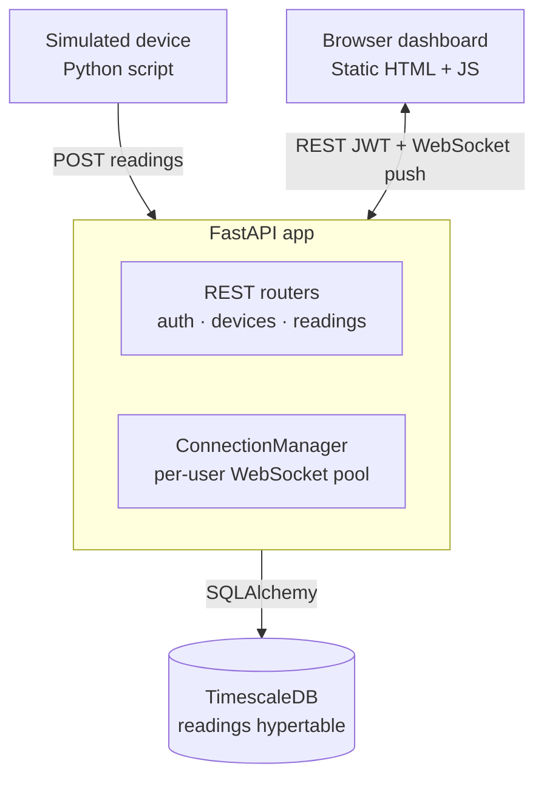

# telemetry-system

A real-time telemetry ingestion and monitoring backend. Simulated devices POST sensor readings over REST; every reading is instantly pushed to connected dashboard clients over a WebSocket — no polling. Historical data is queryable via REST, including TimescaleDB-powered time-bucketed aggregates (avg/min/max) for arbitrary intervals.

Every prior project in this portfolio was request → response. This one adds a genuinely different architectural pillar: persistent stateful connections, server-initiated push, and time-series storage at scale.

## Architecture



## Tech stack

| Layer | Choice | Why |
|---|---|---|
| API framework | FastAPI + Uvicorn | Native async WebSocket support |
| Database | PostgreSQL 18 + TimescaleDB | Hypertables auto-partition time-series data by time for fast range queries |
| ORM | SQLAlchemy | Composite primary key on `readings` (id, recorded_at) — required for hypertable partitioning |
| Auth | JWT via `Authorization: Bearer` header (HTTP) / query param (WebSocket handshake) | Browsers can't set custom headers on a WS handshake — the query-param exception is deliberate and documented |
| Testing | pytest + FastAPI TestClient | Isolated `telemetry_test_db` (real Postgres, not SQLite — SQLite can't replicate a hypertable) |
| Containerization | Docker Compose (`timescale/timescaledb:latest-pg18` + custom API image) | Not yet run locally — Docker Desktop install/verification is deferred to Project 5 |

## Setup

1. Clone the repo and create a venv: `py -3.13 -m venv venv`, then activate it.
2. `pip install -r requirements.txt`
3. Copy `.env.example` to `.env` and fill in real values (`DATABASE_URL`, `SECRET_KEY`, `POSTGRES_PASSWORD`).
4. Ensure PostgreSQL 18 + TimescaleDB extension are installed and running locally.
5. `python create_tables.py`
6. In `psql`: `SELECT create_hypertable('readings', 'recorded_at');` — **manual step, not yet automated** (a known limitation; a startup check or Alembic migration would be the natural fix).
7. `uvicorn app.main:app --reload`
7. Open `http://127.0.0.1:8000/static/dashboard.html` for the live dashboard, or run `python simulate_device.py` to generate demo data.

## Deployment

`docker compose up` on a fresh host needs `POSTGRES_PASSWORD` and `SECRET_KEY` set (compose fails loudly if not). The API creates tables and the hypertable on startup and binds `0.0.0.0:$PORT` (default 8000). The container runs as a non-root user.

**Run exactly one API replica / one uvicorn worker.** Live WebSocket push relies on in-process connection state, so scaling out breaks it (see Known limitations).

## Endpoints

| Method | Path | Description |
|---|---|---|
| POST | `/auth/register` | Create a user |
| POST | `/auth/login` | Get a JWT access token |
| GET | `/auth/me` | Current authenticated user |
| POST | `/devices` | Create a device |
| GET | `/devices` | List your devices |
| GET | `/devices/{id}` | Get a device by id |
| DELETE | `/devices/{id}` | Delete a device |
| POST | `/devices/{id}/readings` | Post a reading (broadcasts live over WebSocket) |
| GET | `/devices/{id}/readings/recent` | Most recent N readings |
| GET | `/devices/{id}/readings/range` | Readings within a time window |
| GET | `/devices/{id}/readings/aggregate` | Time-bucketed avg/min/max (TimescaleDB `time_bucket`) |
| WS | `/ws?token=<jwt>` | Live per-user reading broadcast |

All data is scoped to `current_user.id`; cross-user access returns 404, not 403, to avoid confirming resource existence to an unauthorized caller.

## Testing

26 pytest tests across three files (`test_api.py`, `test_ws.py`, `test_readings_history.py`), run against an isolated `telemetry_test_db` — a real Postgres/TimescaleDB instance, not SQLite, since the `readings` hypertable can't be replicated in-memory. Coverage includes auth, full user-data isolation (including WebSocket broadcast isolation — user A's readings never reach user B's socket), the reading→broadcast→device-status pipeline, and TimescaleDB aggregate correctness.

Automated testing caught two real bugs before they reached manual testing: a `passlib`/`bcrypt` version mismatch that silently broke all password hashing, and a missing `autoincrement=True` on the `readings` composite primary key that blocked every insert. Both were pre-existing in the app code, not artifacts of the test suite.

```powershell
pytest tests/ -v
```

## Known limitations

- Schema/hypertable setup runs from a startup hook, not a migration tool, so future schema changes (column adds etc.) are not applied automatically.
- **Single replica only:** connected WebSocket clients are held in per-process memory (`ConnectionManager` in `app/routers/ws.py`), with no Redis/pub-sub. Running more than one replica or uvicorn worker breaks live push: a reading posted to one instance only reaches sockets connected to that same instance.
- `docker-compose.yml` is written but not yet run locally (Docker Desktop install deferred to Project 5).
- No pagination on `/devices/{id}/readings/recent` beyond a `limit` query param.